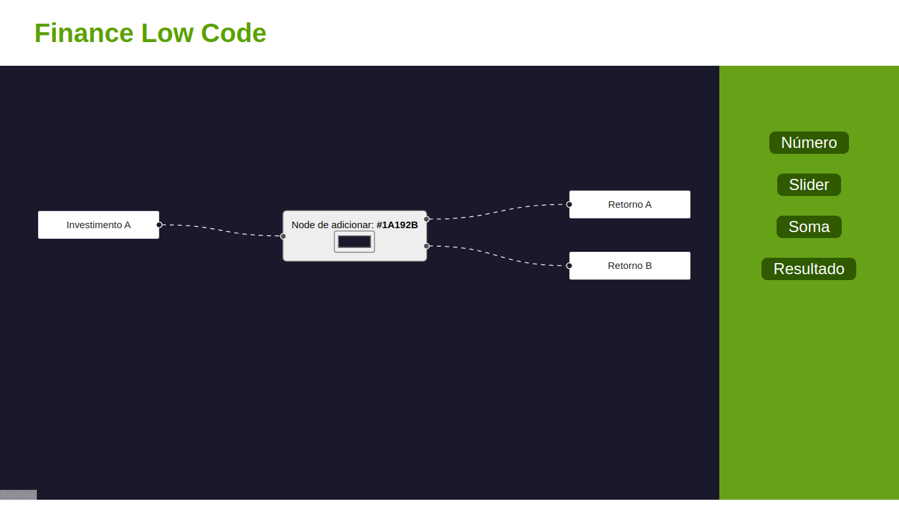

# Finance analysis

# Índice
- [Descrição](#id01)
- [Funcionalidades](#id02)
- [Desafios](#id03)
- [Tecnologia_usadas](#id04)
- [Autor](#id05)

# 📃 Descrição 

Uma aplicação de gerenciamento de finanças usando ambiente low code desenvolvido em ReactJs. 
Através da aplicação é possível gerenciar informações de investimentos usando códigos seguindo a ideia de _low code_. Isso é possível graças a códigos pre gerenciados, que através de programação visual com _node editor_ é possível programar a utilização da ferramenta.

Data início: 03/02/2023

# 🧾 Funcionalidades 

- No sidebar é possível adicionar novos nodes 
- Cada node tem um propósito e um conjunto de código
- Existem nodes:
    - `Números`
    - `Sliders`
    - `Soma de números`
    - `Mudança de cor de fundo`

  </img>

# 🏆 Desafios 

Este projeto foi muito importante para mim pois foi a primeira library de react que aprendi apenas lendo a documentação e não consultando outro material. A razão disso é que é uma biblioteca pouco utilizada pela comunidade dev, portanto com material escasso.

As maiores dificuldades foram saber conectar e interagir os nodes. Utilizei de props assim como indica a documentação, porém não soube como interagir nodes pela handleConnection - função de executar por conexão de nodes. Isso fez com que os nodes não seguissem o padrão de programação visual

O maior aprendizado foi a como utilizar _props_ do react de forma mais avançada.

# 💻 Tecnologia usadas 

 

- 
- 
- 
- 
- 
- 

# 🤓 Autor 

- GitHub: https://www.github.com/RamosTailon

- Email: [tailonramos11@gmail.com](mailto:tailonramos11@gmail.com)

- Linkedin: https://www.linkedin.com/in/tailon-ramos-25271022a/
